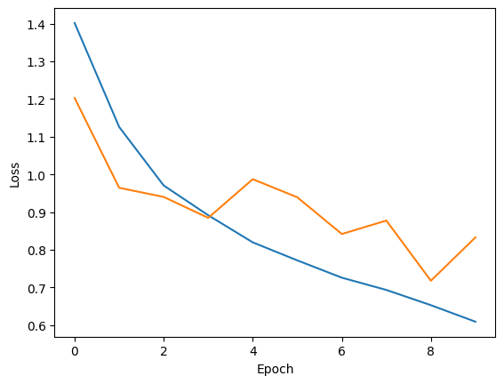

# Musical Emotion

## Autores

Carlos A. Cancino Escobar: [C4ncino](https://github.com/C4ncino)

Juan Pablo Gómez Haro Cabrera: [JuanPabloGHC](https://github.com/JuanPabloGHC)

## Introducción

Este proyecto desarrolla una solución con Inteligencia Artificial y el uso de las API's de OpenAI y de Spotify, para reconocer tu estado de ánimo a través de captura de video y de acuerdo a tu estado de ánimo te recomienda 5 canciones para levantarte el ánimo o mantenerte en uno alegre, reproduciendo las canciones en tu aplicación de spotify.

## Tecnologías

- Tensorflow
  - Facilita la creación de modelos de aprendizaje automático para computadoras de escritorio, dispositivos móviles, la web y la nube, sin importar si eres principiante o experto.
- OpenAI API
  - Ofrece la flexibilidad para personalizar las respuestas de tu chatbot, permitiéndote infundir la personalidad deseada en cada interacción. Esto se logra ajustando los parámetros de los modelos de lenguaje, como el tono y el estilo de las respuestas.
- Sppotipy API
  - Permite acceder a los datos y las funcionalidades del servicio de música en streaming en otras aplicaciones.
- Dotenv
  - Uso de variables de entorno.
- Webbrowser
  - Poder acceder a sitios web o aplicaciones dentro de la computadora.
- Pyautogui
  - Controlar acciones del teclado.
- Cv2
  - Uso de la cámara y dataset de reconocimiento facial.

## Dataset

**Conjunto de datos de imágenes de reconocimiento de emociones faciales**

- Emociones
  - Happy
  - Neutral
  - Angry
  - Sad
  - Sorprendido

1. dataset.zip contains folders with corresponding classes.
2. data.csv contains pathes to images and corresponding labels.

Kovenko, Volodymyr; Shevchuk, Vitalii (2021), “OAHEGA : EMOTION RECOGNITION DATASET”, Mendeley Data, V2, doi: 10.17632/5ck5zz6f2c.2

[Página oficial](https://www.kaggle.com/datasets/sujaykapadnis/emotion-recognition-dataset)

## Arquitectura

```plain
├──📁/documentation
│   └──📁/images
│       ├──🖼️[imágenes de loss]
|       └──🖼️[imágenes de accuracy]
│
├──📁/models
│   └──📄[versiones de modelos de IA entrenados]
│
├──🐍app.py
├──📝.env
├──🐍basic_use.py
├──🐍recomendation.py
├──🐍train.py
└──📝requirements.txt
```

- /documentation:
  - Imágenes para documentar el proceso y resultados del entrenamiento, tanto el loss y el accuracy de cada modelo que se generó.
- /models:
  - Modelos guardados por versiones previamente entrenados.
- app.py:
  - Programa principal que ejecuta todo el programa.
- .env:
  - Se almacenan las variables de entorno, para almacenar los tokens y credenciales de las API's, se tiene el .env.example como ejemplo.
- basic_use.py:
  - Código para la captura de video, procesamiento de imagen y la predicción del estado de ánimo.
- recomendation.py:
  - Código para hacer uso de la API de openai para la recomendación de música de acuerdo a tu estado de ánimo y posteriormente reproducirlas en la aplicación de spotify con su API.
- requirements.txt:
  - Las dependencias que se utilizarón en el proyecto.

## Limitantes

- Se necesita tener instalada la aplicación de Spotify en la computadora para reproducir la música.

- Si deseas entrenar un modelo, es necesario utilizar una computadora con suficientes recursos ya que llegan a ser muy tardados por ser una red neuronal convolucional.

## Instalación

- Clonar el repositorio.
- Moverte a la carpeta del proyecto.
- Instalar todas las dependencias.

```bash
git clone https://github.com/C4ncino/Musical_Emotions.git

cd Musical_Emotions
```

En la instalación de dependencias recomendamos tener un entorno virtual en caso de que no desees uno puedes ir directo a la instalación de [dependencias](#dependencies), para crearlo ejecuta lo siguiente:

```bash
python -m venv venv
```

La activación del entorno virtual depende de su sistema operativo:

Linux:

```bash
source venv/bin/activate
```

Windows:

```bash
venv\Scripts\activate
```

Windows con bash:

```bash
source venv\Scripts\activate
```

<span id="dependencies" ></span>

Una vez activado el entorno virtual, se instalan las dependencias:

```bash
pip install -r requirements.txt
```

## Implementación de IA

Se usó una red neuronal convulacinoal para el procesamiento y entrenamiento del modelo para reconocimiento de emociones con el uso del dataset y de esta manera poderlo aplicar con el usuario.

## Capa extra de IA mediante la API de OpenAI

Se usó la API para hacerle una petición de recomendaciones musicales de acuerdo al estado de ánimo.

- Rol del sistema:
  - Eres un sistema recomendador de música de acuerdo al estado de ánimo. Recomiendas 5 canciones. En caso de tener un ánimo Tristeza, Enojo, Nuetral, recomiendas música que levante el ánimo de la persona para sentirse mejor. En caso de tener un ánimo de Alegría, Asombro, Sorprendido, recomiendas música que mantenga ese estado de ánimo. Solo dame la lista de canciones que se dividan por , cada sugerencia y que se separe el autor de la cancion con un - .
- Contenido:
  - "Estado de ánimo: <emoción>"

Además se usó la API de spotipy para poder acceder a una canción en específico con su artista para poderla reproducir con el uso de su uri y la duración de esta para el tiempo de espera entre canción y canción.

- Se requieren los tokens y credenciales específicas de cada API para su uso.

## Relevancia Social

La propuesta que se tiene es para poder tener un impacto positivo en las emociones de las personas, brindandoles un ambiente agradable en donde la música acompañe a una persona en su estado de ánimo, que en caso de ser negativo; ayude en mejorarlo y en caso de ser positivo; ayude a mantenerlo y poderlo expresar de mejor manera.

## Innovación y Creatividad

Con el uso de herramientas existentes se unen para brindar una propuesta de una actividad cotidiana, que es el escuchar música, para brindar un apoyo rápido y lo más acertado para tu estado de ánimo.

## Modelos y resultados

Para las arquitecturas de las versiones 1, 2 y 3 se utilizó de capa base el modelo VGG16 de TensorFlow con un input de 224x224x3. las modificaciones que sufrieron se encuentran en las capas posteriores a las convoluciones, así mismo todas cuentan con una capa de salida de 5 neuronas.

Por otro lado, los modelo del 4 al 6 cuentan con la misma arquitectura, sin embargo en este caso se fue variando entre los inputshape entre 64x64x3 y 128x128x3. Al igual que las épocas y el learning rate.

### v1

Arquitectura del modelo

| Tipo de capa | Neuronas | Dropout |
| ------------ | -------- | ------- |
| Densa        | 1024     | 0.4     |
| Densa        | 512      | 0.2     |
| Densa        | 256      | 0.1     |


### v2

Arquitectura del modelo

| Tipo de capa | Neuronas | Dropout |
| ------------ | -------- | ------- |
| Densa        | 512      | 0.6     |
| Densa        | 256      | 0.4     |
| Densa        | 256      | 0.4     |
| Densa        | 128      | 0.2     |

Resultados


### v3

Arquitectura del modelo

| Tipo de capa | Neuronas | Dropout |
| ------------ | -------- | ------- |
| Densa        | 512      | 0.5     |
| Densa        | 256      | 0.25    |
| Densa        | 256      | 0.25    |
| Densa        | 128      | 0.1     |
| Densa        | 32       | -       |

Resultados




### v4

Arquitectura del modelo

| Capa | Tipo               | Tamaño/Filtros     | Función de Activación | Otros                                           |
| ---- | ------------------ | ------------------ | --------------------- | ----------------------------------------------- |
| 1    | Input              | Shape: input_shape | -                     |                                                 |
| 2    | Conv2D             | Filtros: 32        | ELU                   | Padding: same<br> Kernel initializer: he_normal |
| 3    | BatchNormalization | -                  | -                     | Axis: -1                                        |
| 4    | Conv2D             | Filtros: 32        | ELU                   | Padding: same<br> Kernel initializer: he_normal |
| 5    | BatchNormalization | -                  | -                     | Axis: -1                                        |
|      | MaxPooling2D       | Pool size: (2, 2)  | -                     |                                                 |
|      | Dropout            | Ratio: 0.25        | -                     |                                                 |
| 6    | Conv2D             | Filtros: 64        | ELU                   | Padding: same<br> Kernel initializer: he_normal |
| 7    | BatchNormalization | -                  | -                     | Axis: -1                                        |
| 8    | Conv2D             | Filtros: 64        | ELU                   | Padding: same<br> Kernel initializer: he_normal |
| 9    | BatchNormalization | -                  | -                     | Axis: -1                                        |
|      | MaxPooling2D       | Pool size: (2, 2)  | -                     |                                                 |
|      | Dropout            | Ratio: 0.25        | -                     |                                                 |
| 10   | Conv2D             | Filtros: 128       | ELU                   | Padding: same<br> Kernel initializer: he_normal |
| 11   | BatchNormalization | -                  | -                     | Axis: -1                                        |
| 12   | Conv2D             | Filtros: 128       | ELU                   | Padding: same<br> Kernel initializer: he_normal |
| 13   | BatchNormalization | -                  | -                     | Axis: -1                                        |
|      | MaxPooling2D       | Pool size: (2, 2)  | -                     |                                                 |
|      | Dropout            | Ratio: 0.25        | -                     |                                                 |
|      | Flatten            | -                  | -                     |                                                 |
| 14   | Dense              | Units: 64          | ELU                   | Kernel initializer: he_normal                   |
| 15   | BatchNormalization | -                  | -                     | Axis: -1                                        |
|      | Dropout            | Ratio: 0.5         | -                     |                                                 |
| 16   | Dense              | Units: 64          | ELU                   | Kernel initializer: he_normal                   |
| 17   | BatchNormalization | -                  | -                     | Axis: -1                                        |
|      | Dropout            | Ratio: 0.5         | -                     |                                                 |
| 18   | Dense              | Units: classes     | Softmax               | Kernel initializer: he_normal                   |

Resultados


### v5 

Resultados


### v6 

Resultados


